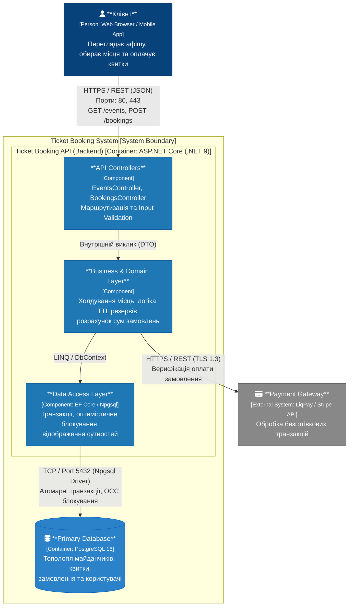
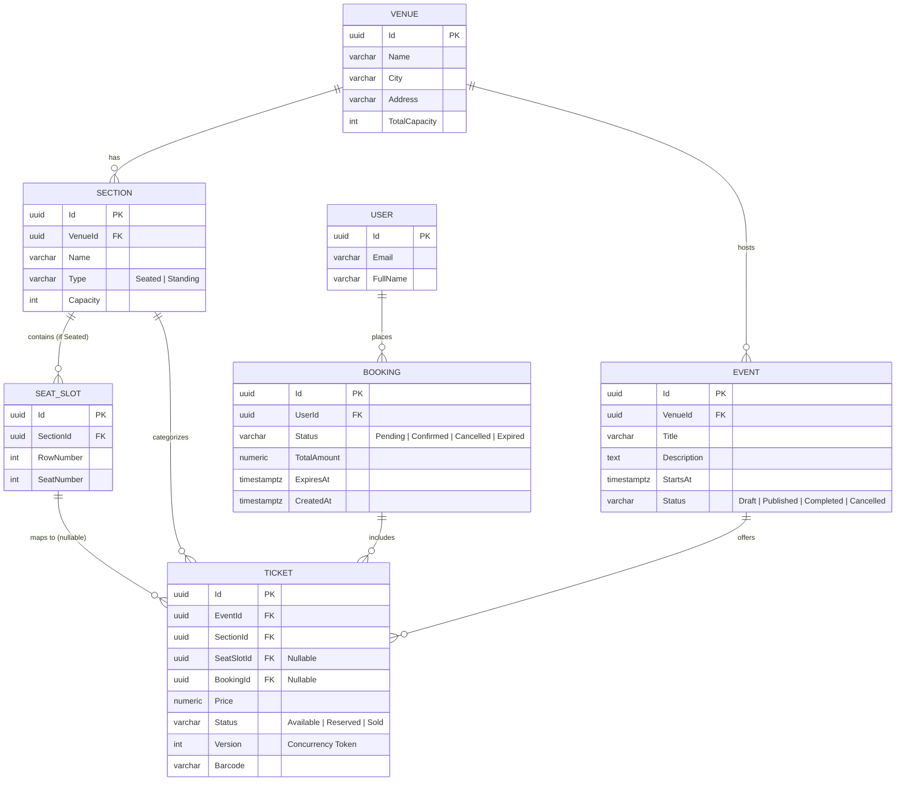

# Concert Ticketing Engine (High-Load Booking Platform)

Платформа для онлайн-бронювання та продажу квитків на концерти в умовах високої конкуренції за спільні ресурси (High Contention / Flash Crowds). Систему спроєктовано з урахуванням пікових навантажень на старті продажів популярних подій із забезпеченням транзакційної цілісності та захисту від подвійного продажу (Double-Booking).

Підтримуються комбіновані типи майданчиків:
* **Сидячі сектори (Seated):** із фіксованими координатами крісел (ряд, номер місця).
* **Зони вільного входу (Standing / General Admission):** фан-зони з контролем загальної місткості (Capacity).

---

## 1. Архітектура системи (C4 Container & Component Model)

Архітектурна схема системи квиткового бронювання, що відображає мережеву взаємодію, внутрішню компонентну структуру сервісу, первинне сховище даних та інтеграцію із зовнішнім платіжним провайдером.



---

## 2. Схема даних (ERD & Persistence Layer)

Модель нормалізована до 3NF. Топологія майданчика (`Venue`, `Section`, `SeatSlot`) строго відділена від комерційних сутностей події (`Event`, `Ticket`), що дозволяє повторно використовувати конфігурацію майданчика для різних концертів без дублювання записів геометрії.



### Ключові оптимізації бази даних:
* **Фан-зони:** Для квитків стоячих секторів поле `SeatSlotId` встановлюється в `NULL`, а контроль переповнення виконується на рівні квоти сектора `Section.Capacity`.
* **Індексація:** Складений індекс `IX_Tickets_EventId_Status` оптимізує фільтрацію доступних квитків під час перегляду схеми залу.
* **Concurrency Check:** Поле `Version` у сутності `Ticket` реалізує токен оптимістичного блокування (OCC) для контролю паралельного доступу.

---

## 3. Специфікація REST API

Інтерактивна документація ендпоінтів та тестування доступні через Swagger UI:
* **Swagger URL:** `http://localhost:5192/swagger`

### Перелік контрактів системи:
| Метод | Маршрут | Опис | Відповідає |
|---|---|---|:---:|
| `GET` | `/api/v1/events` | Отримання каталогу подій з фільтрацією за містом | Катерина |
| `GET` | `/api/v1/events/{id}/tickets` | Перегляд схеми залу та доступних квитків за подією | Катерина |
| `POST` | `/api/v1/bookings` | Транзакційне холдування квитків (TTL 15 хв, захист від Race Condition) | Напарник |
| `POST` | `/api/v1/bookings/{id}/confirm` | Підтвердження оплати, генерація штрихкодів, статус `Sold` | Напарник |
| `DELETE` | `/api/v1/bookings/{id}` | Скасування бронювання та повернення квитків у продаж | Напарник |

---

## 4. Матриця відповідальності (RACI)

Розподіл інженерних завдань між учасниками команди згідно з вимогами лабораторної роботи:

| Етап / Модуль розробки | Катерина | Напарник |
|---|:---:|:---:|
| **Проєктування домену, структури секторів та ER-моделі** | **A / R** | C |
| **Шар персистентності (EF Core, Npgsql, DDL, Seeder)** | **A / R** | I |
| **Модуль каталогу подій (`EventsController`)** | **A / R** | I |
| **Інтеграція та налаштування OpenAPI / Swagger UI** | **A / R** | I |
| **Модуль бронювання (`BookingsController`)** | C | **A / R** |
| **Input Validation (FluentValidation) та глобальний Middleware помилок** | I | **A / R** |
| **Контейнеризація: Dockerfile та docker-compose.yml** | I | **A / R** |
| **Аналіз вузьких місць (Bottleneck Analysis за шаблоном)** | C | **A / R** |
| **Колекція API-запитів (Postman/Bruno з негативними кейсами)** | I | **A / R** |


---

## 5. Інструкція із детермінованого запуску системи

```bash
# 1. Клонування репозиторію
git clone <url_репозиторію>
cd TicketBooking

# 2. Детермінований запуск через Docker Compose
docker-compose up -d --build

# 3. Перевірка статусу контейнерів
docker-compose ps
```

---

## 6. Результати аналізу вузьких місць (Bottleneck Analysis)

### 1. Row Lock Contention (Транзакційне блокування при купівлі популярних місць)
* **Точка відмови:** Таблиця `Tickets` під час одночасного виконання транзакцій бронювання (`POST /api/v1/bookings`) за наявності тисяч запитів на обмежений пул квитків.
* **Причина:** Конкуренція за ексклюзивне блокування рядків у реляційній базі даних. У разі використання песимістичного блокування виникає черга очікування локів (Lock Wait Timeout) і ризик виникнення Deadlock.
* **Вплив:** Різке зростання $p99$ затримки відповіді з <100 мс до кількох секунд, масові помилки `504 Gateway Timeout` та `409 Conflict`.
* **Шляхи оптимізації:** Використання черги повідомлень (RabbitMQ/Kafka) для серіалізації запитів на бронювання або застосування In-Memory сховища (Redis) з атомарними операціями через Lua-скрипти перед записом у реляційну БД.

### 2. Database Connection Pool Exhaustion (Вичерпання пулу з'єднань БД)
* **Точка відмови:** Пул підключень Npgsql / PostgreSQL (`Max Pool Size`).
* **Причина:** Під час сплеску трафіку (Flash Crowd) кількість одночасних HTTP-запитів значно перевищує ліміт пулу з'єднань до бази даних (за замовчуванням 100 підключень).
* **Вплив:** Потоки ASP.NET Core блокуються в очікуванні вільного підключення з пулу, що призводить до вичерпання пулу потоків веб-сервера (Thread Pool Starvation) і відмови всього API.
* **Шляхи оптимізації:** Впровадження connection pooler (PgBouncer) на рівні інфраструктури, агресивне кешування незмінних даних (каталог подій, геометрія залу) на рівні Redis/CDN, скорочення часу утримання відкритих транзакцій до мінімуму.

### 3. Read Amplification & I/O Overhead при читанні схеми залу
* **Точка відмови:** Дискова підсистема СУБД (Disk I/O) під час масового опитування схеми квитків (`GET /api/v1/events/{id}/tickets`).
* **Причина:** Користувачі постійно оновлюють сторінку вибору місць, генеруючи важкі `SELECT`-запити з `JOIN` до таблиць `Sections`, `SeatSlots` і `Tickets`.
* **Вплив:** Вичерпання буферного пулу PostgreSQL (`shared_buffers`), зростання черги читання з диска, деградація продуктивності всієї системи.
* **Шляхи оптимізації:** Використання HTTP-кешування з заголовками `ETag` / `If-None-Match`, оновлення стану зайнятих місць на клієнті через Server-Sent Events (SSE) або WebSockets замість частих опитувань (polling).